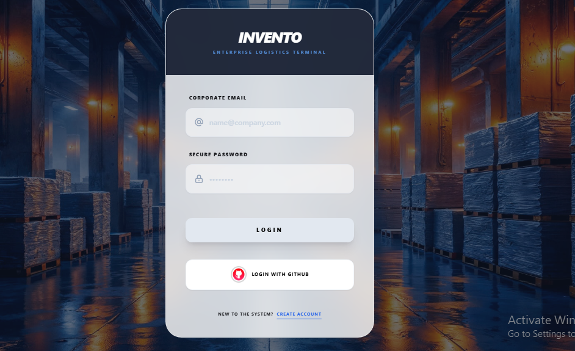
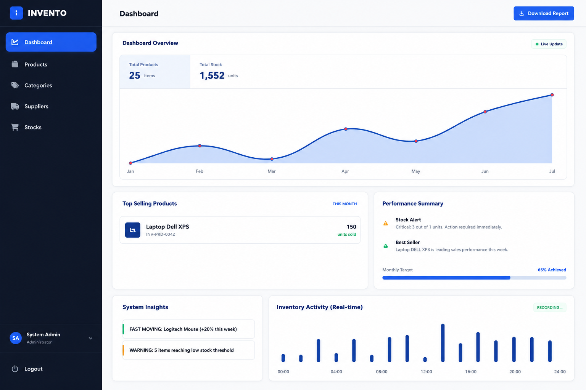
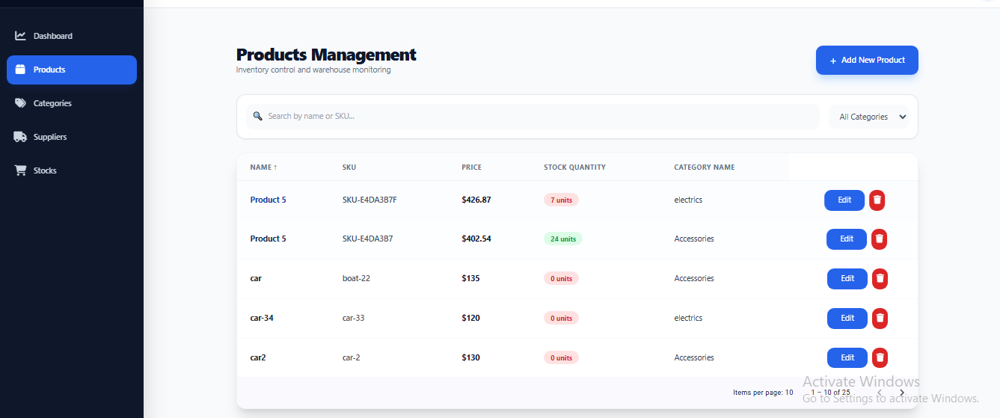
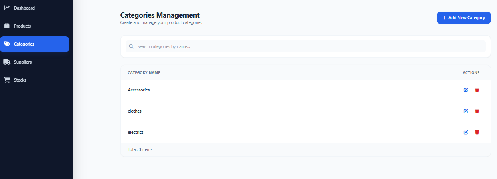
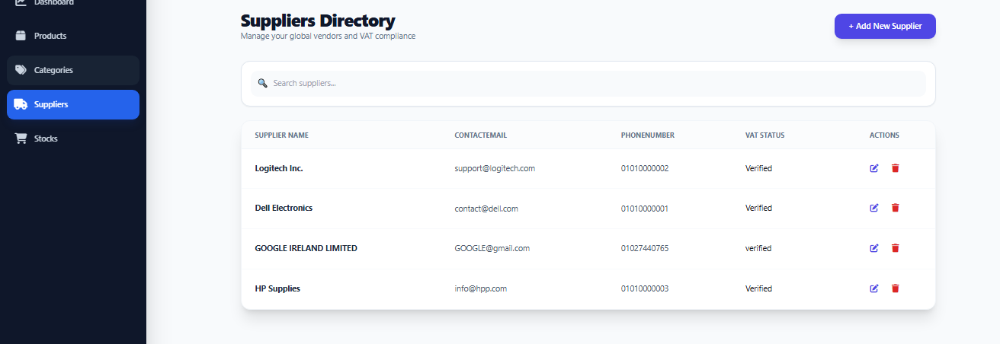

[](https://github.com/Omaremad763/Invento/actions)
[](https://github.com/Omaremad763/Invento)
[](https://github.com/Omaremad763/Invento)
[](https://github.com/Omaremad763/Invento)
[](https://github.com/Omaremad763/Invento)
[](https://github.com/Omaremad763/Invento)
[](https://github.com/Omaremad763/Invento)
[](https://github.com/Omaremad763/Invento)
[](https://github.com/Omaremad763/Invento)


[]

---
# Invento

> Modern Inventory Management System built with ASP.NET Core & Angular.

A full-stack inventory management system designed to solve real inventory problems while serving as a long-term software engineering playground for exploring architecture, security, DevOps, and modern backend practices.


---

# 🌟 Highlights

- 🏗️ Clean Architecture
- ⚡ CQRS + MediatR
- 🔐 JWT + GitHub OAuth + Email Confirmation
- 📦 Dockerized Development Environment
- 🚀 GitHub Actions CI/CD
- 📊 Serilog + Seq + Prometheus + Grafana
- ⚡ Redis & In-Memory Caching
- 🧪 Dedicated Learning Branches
- 🛡️ Secure Coding Experiments

---

# 📑 Table of Contents

- [📖 Overview](#-overview)
- [🎯 Why Invento?](#-why-invento)
- [🚀 Project Goals](#-project-goals)
- [✨ Core Features](#-core-features)
- [🖼️ Screenshots](#️-screenshots)
- [🎥 Demo](#-demo)
- [🛠️ Technology Stack](#️-technology-stack)
- [🏗️ Architecture](#️-architecture)
- [🧱 High-Level Architecture](#-high-level-architecture)
- [📁 Project Structure](#-project-structure)
- [⚙️ Backend Highlights](#️-backend-highlights)
- [🎨 Frontend Highlights](#-frontend-highlights)
- [🔐 Authentication](#-authentication)
- [🗃️ Inventory Management](#️-inventory-management)
- [📊 Dashboard](#-dashboard)
- [⚡ Performance](#-performance)
- [📝 Logging](#-logging)
- [📈 Monitoring](#-monitoring)
- [🐳 Docker](#-docker)
- [🚀 Getting Started](#-getting-started)
- [🔄 CI/CD](#-cicd)
- [🌿 Branching Strategy](#-branching-strategy)
- [🧪 Learning Branches](#-learning-branches)
- [🔐 Security](#-security)
- [📦 Deployment](#-deployment)
- [📈 Future Roadmap](#-future-roadmap)
- [💡 Lessons Learned](#-lessons-learned)
- [❤️ Engineering Journey](#️-engineering-journey)
- [🤝 Contributing](#-contributing)
- [📄 License](#-license)
- [👨‍💻 Author](#-author)
- [⭐ Support](#-support)
# 📖 Overview

Invento is a modern full-stack Inventory Management System developed using **ASP.NET Core** and **Angular**.

Although the application solves real inventory management problems, the primary goal of the project was to build a production-like application while learning modern software engineering concepts.

Instead of creating dozens of isolated tutorial projects, every new concept learned was integrated into Invento to evaluate how it behaves inside a real application.

Because of that, Invento gradually evolved into both:

- A practical Inventory Management System.
- A long-term Software Engineering Playground.

---

# 🎯 Why Invento?

Learning individual technologies is easy.

Building them together into one maintainable application is much harder.

Invento was created to bridge that gap.

Throughout the project I explored topics including:

- Clean Architecture
- CQRS
- Authentication
- Authorization
- Caching
- Docker
- CI/CD
- Observability
- Secure Coding
- Testing
- Deployment

while continuously integrating them into a single codebase.

---

# 🚀 Project Goals

- Build a maintainable full-stack application.
- Practice modern backend architecture.
- Learn scalable application design.
- Explore authentication & authorization.
- Understand caching strategies.
- Apply DevOps workflows.
- Improve frontend architecture.
- Experiment with security best practices.
- Practice software design patterns.
- Keep improving one real-world project instead of creating many small demos.

---

# ✨ Core Features

## Inventory Management

- Product Management
- Category Management
- Supplier Management
- Stock Transactions
- Inventory History
- Soft Delete
- Search
- Filtering
- Sorting
- Pagination

---

## Authentication

- JWT Authentication
- Email Confirmation
- SMTP Integration
- GitHub OAuth Login
- Role-Based Authorization

---

## Dashboard

- Business Metrics
- Cached Dashboard
- Statistics
- Performance Overview

---

## Infrastructure

- Docker
- Docker Compose
- PostgreSQL
- Redis Cache
- In-Memory Cache

---

## Observability

- Serilog
- Seq
- Prometheus
- Grafana

---

## Security

- JWT
- Validation
- FluentValidation
- Global Exception Handling
- Secure Authentication Flow

---

## Developer Experience

- Clean Architecture
- CQRS
- MediatR
- Repository Pattern
- Unit of Work
- AutoMapper
- FluentValidation
- Dependency Injection

---

# 🖼️ Screenshots
## Login



---

## Dashboard



---

## Products



---

## Categories



---

## Suppliers




---

# 🎥 Demo

Coming Soon...

---

# 🏗️ Architecture

Invento follows the principles of Clean Architecture to keep business logic isolated from infrastructure concerns.

```text
Presentation
      │
Application
      │
Domain
      │
Infrastructure
```

The project adopts CQRS to separate read and write operations and improve maintainability.

---

# 🧱 High-Level Architecture

```text
Angular
    │
REST API
    │
ASP.NET Core
    │
Application Layer
    │
Domain Layer
    │
Infrastructure
    │
PostgreSQL
```

---

# 🔐 Authentication Flow

```text
Register
    │
    ▼
Create User
    │
    ▼
Generate Email Token
    │
    ▼
SMTP
    │
    ▼
User confirms email
    │
    ▼
Login
    │
    ▼
JWT Token
```

---

# ⚡ Caching Strategy

Invento uses multiple caching strategies depending on the use case.

- Redis Cache
- In-Memory Cache

Dashboard data is cached to reduce unnecessary database queries and improve response time.

---

# 📊 Observability

The project includes practical experimentation with modern monitoring tools.

- Serilog
- Seq
- Prometheus
- Grafana

These tools were integrated to better understand application logging and metrics collection.

---

# 🐳 Docker

The project is fully containerized.

Services include:

- API
- Angular
- PostgreSQL
- Redis

Run everything using Docker Compose.

```bash
docker compose up --build
```

---

# 🔄 CI/CD

GitHub Actions automate the project pipeline.

Current workflow includes:

- Build
- Restore
- Docker Build
- Docker Compose Validation
- Health Checks
- Container Logs
- Push Docker Images

---

# 🌱 Branching Strategy

Instead of developing directly on the main branch, Invento follows a staged workflow.

```text
Feature
   │
Unit Test
   │
Base
   │
PreDeploy
   │
Live
```
---

# 🛠️ Technology Stack

## Backend

| Technology | Purpose |
|------------|---------|
| ASP.NET Core 9 | Web API |
| Entity Framework Core | ORM |
| PostgreSQL | Relational Database |
| MediatR | CQRS Implementation |
| AutoMapper | Object Mapping |
| FluentValidation | Request Validation |
| JWT | Authentication |
| ASP.NET Identity | User Management |
| SMTP | Email Confirmation |
| Serilog | Structured Logging |
| Seq | Log Visualization |
| Redis | Distributed Cache |
| IMemoryCache | Local Cache |

---

## Frontend

| Technology | Purpose |
|------------|---------|
| Angular | SPA Framework |
| TypeScript | Language |
| Tailwind CSS | UI Styling |
| RxJS | Reactive Programming |
| Angular Router | Routing |
| Angular HttpClient | API Communication |

---

## DevOps

| Technology | Purpose |
|------------|---------|
| Docker | Containerization |
| Docker Compose | Multi-container Orchestration |
| GitHub Actions | CI/CD |
| Prometheus | Metrics Collection |
| Grafana | Metrics Visualization |

---

# 📁 Project Structure

```text
Invento
│
├── Backend
│   ├── Domain
│   ├── Application
│   ├── Infrastructure
│   └── Presentation
│
├── Front
│   ├── Features
│   ├── Shared
│   ├── Core
│   └── Layout
│
├── Docker
│
├── GitHub Workflows
│
└── Documentation
```

---

# 🏛️ Clean Architecture

The backend follows Clean Architecture principles to separate concerns and improve maintainability.

```text
Presentation
        │
Application
        │
Domain
        │
Infrastructure
```

Each layer has a single responsibility.

### Domain

Contains

- Entities
- Interfaces
- Domain Models
- Business Rules

---

### Application

Contains

- CQRS
- Commands
- Queries
- Validators
- DTOs
- Services
- Mapping
- Behaviors

---

### Infrastructure

Contains

- Entity Framework
- Identity
- SMTP
- Redis
- Repositories
- Logging
- External Services

---

### Presentation

Contains

- Controllers
- Middleware
- Dependency Injection
- Authentication
- Swagger
- API Configuration

---

# ⚙️ Backend Highlights

## CQRS

Commands and Queries are separated using MediatR.

Benefits:

- Better organization
- Easier testing
- Cleaner business logic
- Better scalability

---

## Validation

Every request passes through FluentValidation before reaching the business logic.

Benefits:

- Cleaner controllers
- Centralized validation
- Better error messages

---

## Repository Pattern

Repositories abstract the data access layer.

Advantages:

- Loose coupling
- Easier testing
- Better maintainability

---

## Unit of Work

Coordinates repositories inside a single transaction.

---

## AutoMapper

DTO mapping is centralized using AutoMapper profiles.

---

# 🎨 Frontend Highlights

The Angular application was designed around reusable components and feature separation.

Key concepts include:

- Standalone Components
- Route Guards
- Lazy Loading
- Shared Components
- Reusable Forms
- Generic Services
- HTTP Interceptors
- Responsive Layout

---

# 🔑 Authentication

Invento implements a complete authentication workflow.

Features:

- Register
- Email Confirmation
- Login
- JWT Authentication
- GitHub OAuth
- Authorization

Authentication flow:

```text
Register

↓

Identity User

↓

Generate Confirmation Token

↓

SMTP Email

↓

Confirm Email

↓

Login

↓

JWT

↓

Authorized API Requests
```

---

# 📧 Email Confirmation

SMTP is used to send confirmation emails during registration.

A user cannot access the system before confirming the registered email address.

This improves account security and prevents invalid registrations.

---

# 🗃️ Inventory Management

The inventory module supports

- Products
- Categories
- Suppliers
- Stock Transactions

The project also tracks inventory history, making stock movements easier to audit.

---

# 📊 Dashboard

Dashboard information is optimized using caching.

Examples include

- Total Products
- Total Categories
- Total Suppliers
- Inventory Statistics

> 📷 Replace with Dashboard screenshot here.

---

# ⚡ Performance

Several techniques were applied to improve application performance.

- Redis Cache
- IMemoryCache
- Dashboard Caching
- Efficient EF Core Queries
- Pagination

---

# 🔍 Search

Most listing pages support

- Search
- Pagination
- Sorting
- Filtering

This makes the application usable even with large datasets.

---

# 📝 Logging

Serilog is used for structured logging.

Logs can be viewed through Seq.

Benefits

- Easier debugging
- Better diagnostics
- Structured logs
- Searchable events

---

# 📈 Monitoring

Prometheus and Grafana were explored to better understand application monitoring.

The project includes experimentation with

- Metrics
- Dashboards
- Monitoring Concepts

These integrations were part of the learning journey and helped understand production observability.

---

# 🌿 Branching Strategy

Instead of relying on a single long-lived development branch, Invento follows a staged branching workflow where each branch has a clear responsibility.

```text
Feature Branch
      │
      ▼
Unit Test
      │
      ▼
Base
      │
      ▼
PreDeploy
      │
      ▼
Live
```

## Feature Branches

Every new feature is developed inside its own isolated branch.

Examples include:

- Authentication
- Products
- Categories
- Suppliers
- Dashboard
- Stock Transactions

Each feature contains both backend and frontend changes before moving to the testing stage.

---

## Unit Test Branch

Once a feature is completed, automated tests are added and validated.

The project also uses Git Hooks to ensure quality before integration.

---

## Base Branch

This branch acts as the integration branch where completed features are merged together.

It represents the current development state of the application.

---

## PreDeploy Branch

The PreDeploy branch is responsible for final validation before deployment.

Typical tasks include:

- Docker validation
- CI verification
- Configuration review
- Environment checks
- Final bug fixes

This is considered the most stable development branch.

---

## Live Branch

The Live branch is reserved for production-ready releases.

At the moment the project is still evolving, therefore no production release has been published yet.

---

# 🧪 Learning Branches

Invento is more than an inventory system.

It also serves as a long-term engineering playground where new ideas can be explored without affecting the stability of the main application.

---

## Microservices Proof of Concept

A dedicated branch was created to experiment with distributed systems.

Technologies explored include:

- YARP Reverse Proxy
- Consul Service Discovery
- Kafka
- RabbitMQ

The goal was not to migrate Invento into microservices, but to understand the trade-offs involved before making architectural decisions.

---

## Secure Coding

Another dedicated branch focuses entirely on security improvements inspired by Microsoft's ASP.NET documentation.

Topics explored include:

- Google reCAPTCHA
- Anti-Forgery Protection
- HTML Sanitization
- Improved Validation
- Better Authentication Flow
- Rate Limiting
- Secure Exception Handling
- Memory Improvements

Keeping these experiments isolated allows the project to evolve while maintaining a stable main development flow.

---

# 🔐 Security

Current security features include:

- JWT Authentication
- Email Confirmation
- SMTP Integration
- GitHub OAuth
- Role-Based Authorization
- FluentValidation
- Global Exception Middleware
- Password Hashing using ASP.NET Identity

Security is continuously improved as new best practices are learned.

---

# 📦 Deployment

The project is fully containerized using Docker.

Deployment workflow includes:

- PostgreSQL Container
- Redis Container
- ASP.NET Core API
- Angular Client

Docker Compose orchestrates all required services.

---

# ⚙️ CI/CD

GitHub Actions automate multiple development tasks.

Current pipeline includes:

- Restore Dependencies
- Build Solution
- Docker Build
- Docker Compose Validation
- Container Health Checks
- Log Collection
- Image Publishing

This pipeline helps catch deployment issues early.

---

# 📈 Future Roadmap

Invento is intentionally designed as an evolving project.

Future improvements may include:

- Multi Warehouse Support
- Purchase Orders
- Sales Orders
- Invoice Management
- Barcode Scanner
- Advanced Reporting
- Notifications
- Background Jobs
- Audit Logs Expansion
- Refresh Tokens
- Multi-Tenant Support
- SignalR Notifications
- Export to Excel & PDF
- Integration Tests
- Performance Benchmarking
- Kubernetes Deployment
- Production Monitoring

---

# 💡 Lessons Learned

Invento taught me much more than building an inventory system.

Some of the most valuable lessons include:

- Designing maintainable software is harder than writing features.
- Architectural decisions have long-term consequences.
- Shipping software requires more than writing business logic.
- Docker simplifies development consistency.
- Observability is essential for understanding applications.
- Security should be considered from the beginning.
- Small continuous improvements lead to significant long-term progress.

---

# ❤️ Engineering Journey

Invento started as a simple inventory management application.

Over time it became a place where every newly learned concept could be applied to a real project.

Rather than creating isolated demo applications, I preferred integrating new technologies into an existing codebase to better understand how they interact together.

This repository reflects an ongoing engineering journey rather than a finished product.

Every feature represents an opportunity to learn something new, improve existing code, and explore better software engineering practices.

---

# 🤝 Contributing

Contributions, suggestions, and feedback are always welcome.

If you discover a bug or have an idea for improvement, feel free to open an issue or submit a pull request.

---

# 📄 License

This project is currently released under the MIT License.

See the LICENSE file for more information.

---

# 👨‍💻 Author

**Omar Emad**

Software Engineer | Full Stack Development

LinkedIn

> https://www.linkedin.com/in/omar-abusaif/

Portfolio

> (https://omar-emad.vercel.app

---

# ⭐ Support

If you found this project useful, consider giving it a star ⭐.

It helps others discover the project and motivates future improvements.

---

> **Invento is not intended to be a finished ERP system.**
>
> It is a continuously evolving software engineering project where architecture, design, security, DevOps, and modern development practices can be explored within a real-world application.
